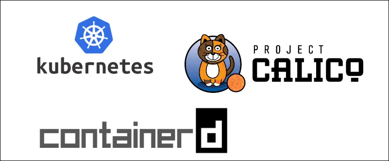

# How to Setup Kubernetes Cluster with Containerd CRI and Calico CNI



This document provides a full step by step procedure to install k8 cluster in any Cloud platform (AWS, Azure, GCP,..) or BareMetal servers

### Before you begin
* A compatible Linux host. The Kubernetes project provides generic instructions for Linux distributions based on Debian and Red Hat, and those distributions without a package manager.
* 2 GB or more of RAM per machine (any less will leave little room for your apps).
* 2 CPUs or more for control plane machines.
* Full network connectivity between all machines in the cluster (public or private network is fine).
* Unique hostname, MAC address, and product_uuid for every node. 
* Certain ports are needed to be open on your machines. 

### Ports and Protocols
Control plane
<table>
  <tr>
    <th>Protocol</th>
    <th>Direction</th>
    <th>Port Range</th>
    <th>Purpose</th>
    <th>Used By</th>
  </tr>
  <tr>
    <td>TCP</td>
    <td>Inbound</td>
    <td>6443</td>
    <td>Kubernetes API server</td>
    <td>All</td>
  </tr>
  <tr>
    <td>TCP</td>
    <td>Inbound</td>
    <td>2379-2380</td>
    <td>etcd server client API</td>
    <td>kube-apiserver, etcd</td>
  </tr>
  <tr>
    <td>TCP</td>
    <td>Inbound</td>
    <td>10250</td>
    <td>Kubelet API</td>
    <td>Self, Control plane</td>
  </tr>
  <tr>
    <td>TCP</td>
    <td>Inbound</td>
    <td>10259</td>
    <td>kube-scheduler</td>
    <td>Self</td>
  </tr>
  <tr>
    <td>TCP</td>
    <td>Inbound</td>
    <td>10257</td>
    <td>kube-controller-manager</td>
    <td>Self</td>
  </tr>
  </table>

Worker node(s)
<table>
  <tr>
    <th>Protocol</th>
    <th>Direction</th>
    <th>Port Range</th>
    <th>Purpose</th>
    <th>Used By</th>
  </tr>
  <tr>
    <td>TCP</td>
    <td>Inbound</td>
    <td>10250</td>
    <td>Kubelet API</td>
    <td>Self, Control plane</td>
  </tr>
   <tr>
    <td>TCP</td>
    <td>Inbound</td>
    <td>10256</td>
    <td>kube-proxy</td>
    <td>Self, Load balancers</td>
  </tr>
   <tr>
    <td>TCP</td>
    <td>Inbound</td>
    <td>30000-32767</td>
    <td>NodePort Services†</td>
    <td>All</td>
  </tr>
   <tr>
    <td>UDP</td>
    <td>Inbound</td>
    <td>30000-32767</td>
    <td>NodePort Services†</td>
    <td>All</td>
  </tr>
</table> 

For the following installation I have used 
- Container Runtime Interface(CRI) - Containerd
- K8 – (refer version from official documentation > <a href="https://kubernetes.io/docs/setup/production-environment/tools/kubeadm/install-kubeadm/">K8-Doc</a>)
- Container Network Interface (CNI)- Calico
# Setup Control plane / Master Node
## Step 1: Set Hostname, Set ip and Update System

```
sudo su
cd /etc/netplan
ls
cp 50-cloud-init.yaml 50-cloud-init.yaml.old
ls
vi 50-cloud-init.yaml
```
```
network:
  ethernets:
    ens5:
      addresses:
      - <your-private-ip>/24
      gateway4: <your-gateway-ip>
      nameservers:
        addresses:
        - 8.8.8.8
```
```
netplan apply
ping 8.8.8.8
ip a
ip route show default
hostnamectl set-hostname masternode
vi /etc/hosts
```
```
<masternode-private-ip> masternode localhost
<workernode-private-ip> workernode
```
```
apt update && apt upgrade -y
reboot
ping 8.8.8.8
ping masternode
ping localhost
```
## Step 2: Disable Swap
```
swapoff -a
vi /etc/fstab
```
Find the line that includes the swap and comment it out by adding # at the beginning<br>
\# /swap.img none swap sw 0 0
```
systemctl daemon-reexec
systemctl daemon-reload
```
## Step 3: Load Kernel Modules and Sysctl Settings
```
cat <<EOF | sudo tee /etc/modules-load.d/k8s.conf
overlay
br_netfilter
EOF

modprobe overlay
modprobe br_netfilter

cat <<EOF | sudo tee /etc/sysctl.d/k8s.conf
net.bridge.bridge-nf-call-iptables = 1
net.bridge.bridge-nf-call-ip6tables = 1
net.ipv4.ip_forward = 1
EOF

sysctl --system
```

## Step 4: Installing a container runtime - Containerd
```
apt install -y containerd
mkdir -p /etc/containerd
containerd config default | sudo tee /etc/containerd/config.toml
vi /etc/containerd/config.toml
```
Find: [plugins.”io.containerd.grpc.v1.cri”.containerd.runtimes.runc.options]

SystemdCgroup = false<br>
Change to:<br>
SystemdCgroup = true
```
systemctl restart containerd
systemctl enable containerd
```
## Step 5: Install kubeadm, kubelet, kubectl
```
apt-get update  
apt-get install -y apt-transport-https ca-certificates curl gpg
curl -fsSL https://pkgs.k8s.io/core:/stable:/v1.33/deb/Release.key | sudo gpg --dearmor -o /etc/apt/keyrings/kubernetes-apt-keyring.gpg
echo 'deb [signed-by=/etc/apt/keyrings/kubernetes-apt-keyring.gpg] https://pkgs.k8s.io/core:/stable:/v1.33/deb/ /' | sudo tee /etc/apt/sources.list.d/kubernetes.list
apt-get update
apt-get install -y kubelet kubeadm kubectl
apt-mark hold kubelet kubeadm kubectl
systemctl enable --now kubelet
systemctl status kubeclt
```
## Step 6: initialize the cluster
```
kubeadm init --pod-network-cidr=192.168.0.0/16 --apiserver-advertise-address=<masternode-private-ip> --cri-socket=unix:///var/run/containerd/containerd.sock
```
### Copy and save the kubectl join token in notpad or in some document
```
mkdir -p $HOME/.kube
sudo cp -i /etc/kubernetes/admin.conf $HOME/.kube/config
sudo chown $(id -u):$(id -g) $HOME/.kube/config
export KUBECONFIG=/etc/kubernetes/admin.conf
```
## Step 7: Deploy Pod Network to Cluster - Calico networking and network policy for on-premises deployments
```
kubectl create -f https://raw.githubusercontent.com/projectcalico/calico/v3.30.2/manifests/operator-crds.yaml
kubectl create -f https://raw.githubusercontent.com/projectcalico/calico/v3.30.2/manifests/tigera-operator.yaml
curl https://raw.githubusercontent.com/projectcalico/calico/v3.30.2/manifests/custom-resources.yaml -O
kubectl create -f custom-resources.yaml
```
### Verify Calico installation in your cluster.
```
watch kubectl get pods -n calico-system
```
### Verify Installation
```
kubectl cluster-info
systemctl status containerd
systemctl status kubelet
systemctl status kubeadm
systemctl status kubectl
kubectl get nodes
kubectl get pods -A
```
# Setup Worker-Node(s)
### Follow steps from 1 to 5
<i>Join the Cluster</i><br>
After completing step 1 to 5 now Paste the join token command created from master node in the worker node

example:
> kubeadm join <control-plane-ip\>:6443 --token <token\> --discovery-token-ca-cert-hash sha256:<hash\> \
  --cri-socket=unix:///var/run/containerd/containerd.sock

### Verify Installation in Worker node(s)
```
kubectl cluster-info
systemctl status containerd
systemctl status kubelet
systemctl status kubeadm
systemctl status kubectl
kubectl get nodes
kubectl get pods -A
```